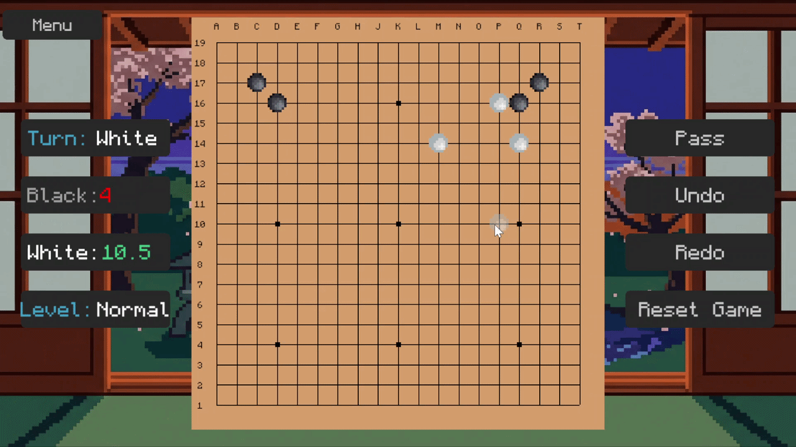

# Go Game



## Overview

A high-performance, fully featured implementation of the classic board game **Go**, engineered in **C++17** using the **SFML** library. This application features a custom-built asynchronous AI opponent, low-latency UI rendering, and a modular object-oriented architecture capable of processing complex game-state validations with zero memory leaks.

## Core Features

* **Asynchronous AI Engine:** Features an intelligent bot (Easy, Medium, Hard) powered by the **Alpha-Beta Pruning** algorithm. The AI executes on a dedicated background thread to ensure zero UI-blocking and maintain a smooth 60 FPS during heavy decision-tree evaluations.
* **Advanced Game Logic & Ruleset:**
  * Full enforcement of Chinese rules (Area Scoring, 7.5 komi).
  * Automated detection of dead stones (0 liberties) and board state evaluation.
  * Algorithmic prevention of suicide moves and Ko rule enforcement.
  * Automated end-game detection and scoring calculation.
* **Dynamic Scalability:** Supports 9x9, 13x13, and standard 19x19 grid configurations.
* **State Management:** Robust Save/Load functionality capturing the complete chronological move history.
* **Customizable UI:** Dynamic styling options for the board and stones.

## Technical Architecture

* **Language:** C++17 (GCC 14.2.0)
* **Graphics Framework:** SFML 3.0.2 (Simple and Fast Multimedia Library)
* **Build System:** CMake (3.15+)
* **Design Patterns:** Object-Oriented Programming (OOP), Multithreaded/Asynchronous Execution

## Installation & Compilation

### Prerequisites

Ensure your development environment includes:

* `g++` (MinGW-w64) 14.2.0 or higher
* `CMake` 3.15 or higher

### Build Instructions

Open your terminal in th
e root project directory and execute the following commands:

```bash
# 1. Create build directory
mkdir build
cd build

# 2. Configure the project
cmake ..

# 3. Compile the executable
cmake --build .

# 4. Launch the application
.\gogame
